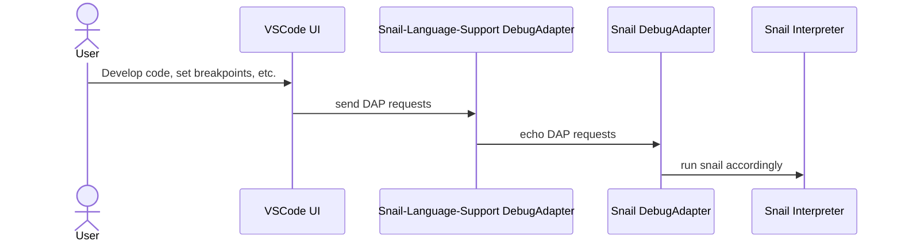

# Overall

this diagram highlights an end-to-end interaction overview

```mermaid
sequenceDiagram
    actor U as User
    participant V as VSCode UI
    participant SLPDA as Snail-Language-Support DebugAdapter
    participant SDA as Snail  DebugAdapter
    participant S as Snail Interpreter

    U ->> V: Develop code, set breakpoints, etc.
    V ->> SLPDA: send DAP requests
    SLPDA ->> SDA: echo DAP requests
    SDA ->> S: run snail accordingly
```