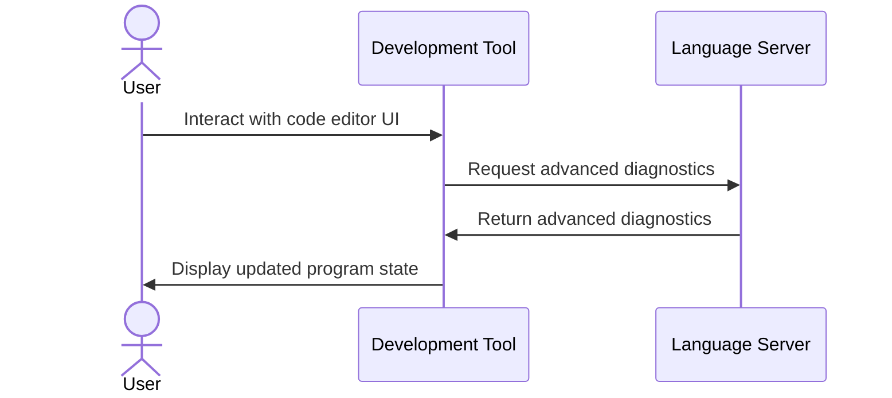

```mermaid
sequenceDiagram

    actor U as User
    participant D as Development Tool
    participant L as Language Server

    U ->> D: Interact with code editor UI
    D ->> L: Request advanced diagnostics
    L ->> D: Return advanced diagnostics
    D ->> U: Display updated program state
```